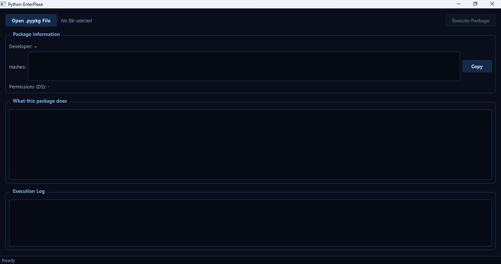

# Python EnterPlase

A PyQt5 desktop application for Windows that reads `.pypkg` package files
and executes their commands using the correct Python version for your system.

## ✨ Features
- Auto-detects Windows version (10+ or 8.1-)
- Uses Python 3.14 on Windows 10/11, Python 3.8 on Windows 8.1 and below
- Prefers already-installed Python over downloading
- Blocks dangerous commands (registry, disk, service, etc.)
- SHA256 / SHA1 hash display with copy button
- Plain-English command preview before execution
- Dark blue PyQt5 interface

## 📥 Download
[**Download PythonEnterPlase.exe**](https://github.com/Fjfycfgdy/Python-EnterPlase/releases/latest/download/PythonEnterPlase.exe)

## 💻 System Requirements
- Windows 8.1 or newer (64-bit) — Recommended
- Windows 7 SP1 (64-bit) — Legacy support
- Windows Vista SP2 (64-bit) — Legacy support
- Internet connection (only for the first-time Python download)

## 📸 Screenshot

## 📄 License
Copyright (c) 2026 Oraxel. All Rights Reserved.
This software is NOT open source. Unauthorized copying, modification,
or distribution is strictly prohibited.
